# EcoTrack — Findings to Date

**Project:** Meteorology-informed multi-source satellite estimation of urban fossil-fuel CO₂, Shivajinagar → Talegaon Dabhade corridor, Pune
**Author:** Janhavi Tupe · **Covers:** feasibility stage (G1–G4) and Phase 1 (NO₂ inversion, NOx → CO₂, inventory comparison, OCO check, TROPOMI CO sector constraint; all numbers after IQR outlier removal) · **Last updated:** 2026-09-24

This document collects every result so far in one place. Day-by-day detail is in
[research_log.md](research_log.md), and the reasoning behind each design change is in
[decisions.md](decisions.md). All numbers below come from files in `outputs/` and can be
regenerated with the commands in §9.

---

## 1. Key findings at a glance

1. **The data supports the project.** TROPOMI gives a median of **26 usable days per month** over the corridor (G2). All three corridor clusters show NO₂ **1.7–2.4× above regional background** in every season (G3).
2. **Direct CO₂ observations are sparse but valuable.** **Pune is an OCO-3 Snapshot Area Map target.** There are **8 strong direct-CO₂ dates** (7 OCO-3 + 1 OCO-2): too few for machine learning, enough for an independent case-study check (D8).
3. **The proposal's waypoints were up to 4.4 km off**, and Talegaon MIDC lay outside the original corridor. Both are fixed: the corridor is now built on the real highway (D9, 269 km²).
4. **Pune + PCMC emit 0.52 kg/s NOx** [95% CI 0.49–0.56] at midday, with an NO₂ lifetime of **1.7 h**, from the base paper's EMG method (R² = 0.99).
5. **The method was tested on synthetic plumes before being trusted.** EMG recovers a known emission within **+12%** (a measured bias); flux divergence within **−4%**. The fit is **insensitive to the Differential Evolution settings** (36 setting/seed combinations give identical results, spread < 0.001%) and to **IQR outlier removal** (0.09% of pixels removed; results change < 2%).
6. **The strongest NO₂ source is central Pune, just south of the corridor, not the corridor itself.** A second, distinct hotspot sits on **Pimpri–Chinchwad** (inside the corridor), 16.7 km away, at ~75% of Pune's strength.
7. **The corridor emits ~21% of the metro's NOx** (0.120 kg/s). This share is stable (20.8–21.8%) across every sensitivity test, even though absolute flux-divergence totals move by up to ±25%.
8. **Two independent methods agree:** flux divergence within 25 km of the source (0.57 kg/s) matches EMG (0.52 kg/s) within 9%, and both place the main source at the same point.
9. **First satellite-based fossil CO₂ estimate: 2.83 Mt/yr ± 32%** (1σ, midday rate) for Pune + PCMC within 25 km. The corridor accounts for **0.60 Mt/yr**. This relies on EDGAR's CO₂:NOx ratio (172), so it is not independent of EDGAR.
10. **Satellite NOx is 22% below EDGAR** in the same area (16.5 vs 21.1 kt/yr). **The two inventories disagree by 3.2×** (EDGAR 3.6 vs ODIAC 11.8 Mt CO₂/yr), which is the strongest argument for an independent satellite check.
11. **The largest uncertainty is the NOx → CO₂ ratio**, as the base paper found. EDGAR's sector ratios range from 115 (industry) to 393 (residential), so the city ratio depends on the sector mix. The OCO-3 comparison (D8) tests exactly this.
12. **OCO-3/OCO-2 cannot see Pune's CO₂ plume** (exploratory D8). The predicted plume is 0.02–0.15 ppm, against 0.5–1 ppm noise and swath artefacts. The data are *consistent* with our estimate (scale factor 1.0 ± 0.9) but set only an **upper limit of ~7–14 Mt CO₂/yr**; the detection threshold for these 8 dates is ~8–15 Mt/yr. So direct CO₂ observation gives a bound, not a measurement, for a city of Pune's size (proposed D11).
13. **TROPOMI CO pins down the NOx → CO₂ ratio.** Pune's CO plume is clearly detected: CO:NOx = **21.2 mol/mol [18.7–23.8]**, 33% above EDGAR. The excess needs more residential/biomass-type combustion than EDGAR assumes (industry replacing transport can't explain it). The CO-constrained CO₂:NOx is **181 (167–197)** instead of 115–393. **Headline estimate: 2.98 Mt CO₂/yr ± 24%** (was ± 32%). **This is where multi-source data measurably improve the result** (proposed D12).
14. **Winds reverse seasonally:** from the east-southeast in October–March (Pune's plume is carried up the corridor) and from the west-northwest in April–May. This is central to interpreting every corridor result.

---

## 2. Study setup (as finalised)

| Item | Value |
|---|---|
| Study period | 1 October 2019 – 31 May 2024, **October–May only** (5 dry seasons, 40 months) |
| Corridor | Old Pune–Mumbai Highway centreline ± 3.5 km, **plus Talegaon MIDC** (2.5 km circle): **269 km²**, one polygon (D9) |
| Clusters | C1 Shivajinagar–Kasarwadi · C2 PCMC (Pimpri, Chinchwad, Akurdi, Nigdi) · C3 Dehu Road–Talegaon |
| NO₂ | TROPOMI OFFL L3 via Google Earth Engine, cloud fraction ≤ 0.3, solar zenith ≤ 70°, IQR outlier removal (per-pixel time series, k = 3; D13) |
| CO₂ | OCO-3 Lite v11r; OCO-2 Lite v11.2r (2019–2023) / v11.3r (2024), quality flag = 0 |
| Meteorology | ERA5 hourly: wind at 10 m, 100 m and 850 hPa; boundary-layer height |
| All thresholds | [configs/study.yaml](../configs/study.yaml), the single source of truth |

---

## 3. Feasibility findings (G1–G4)

### G2 — TROPOMI coverage: **PASS**

| Month | Oct | Nov | Dec | Jan | Feb | Mar | Apr | May |
|---|---|---|---|---|---|---|---|---|
| Mean usable days (5-season average) | 17.4 | 21.8 | 23.4 | 26.4 | 27.6 | 28.8 | 26.2 | 24.6 |

- Median **26** usable days per month; minimum **13** (October 2019 and October 2020); no month below 5. **Monthly composites are viable.**
- October is consistently the weakest month, probably because of late-monsoon cloud.
- "Usable" means at least 50% of the corridor's 230 TROPOMI pixels pass QC on that overpass.
- **Methods note:** the GEE TROPOMI product **has no `qa_value` band**; GEE applies the quality filter during its own processing. Our QC is therefore "GEE's built-in qa filter + cloud fraction ≤ 0.3 + solar zenith ≤ 70°", not "qa ≥ 0.7 applied by us".

### G3 — NO₂ signal over the clusters: **PASS**

Enhancement = cluster mean ÷ 10th percentile of the regional box (73.30–74.30 E, 18.20–19.00 N), per season:

| Season | C1 Shivajinagar–Kasarwadi | C2 PCMC | C3 Dehu Road–Talegaon | Background (mol/m²) |
|---|---|---|---|---|
| 2019–20 | 2.22× | 2.10× | 1.74× | 2.49 × 10⁻⁵ |
| 2020–21 | 2.29× | 2.24× | 1.81× | 3.06 × 10⁻⁵ |
| 2021–22 | 2.31× | 2.15× | 1.71× | 2.87 × 10⁻⁵ |
| 2022–23 | 2.31× | 2.21× | 1.77× | 3.25 × 10⁻⁵ |
| 2023–24 | 2.37× | 2.25× | 1.78× | 3.09 × 10⁻⁵ |

- Every cluster is above the 1.5× threshold in every season, and the ranking never changes.
- **Caveat, confirmed in Phase 1:** C1's high value partly reflects central Pune next door, and C3's partly reflects NO₂ carried downwind from PCMC. G3 shows that a signal exists, not that the clusters are separable.

### G1 — Direct CO₂ observations (OCO-3 and OCO-2): **PARTIAL**

**OCO-3** (893 in-season days scanned, 0 failed downloads):
- Inside the 7 km-wide corridor: 236 good soundings on 10 days, **6 usable** (≥ 20 soundings).
- At city scale (bounding box): **7 strong days** (≥ 50 good soundings).

| Date | Good soundings (bbox) | Mode |
|---|---|---|
| 2019-10-14 | 56 | Snapshot Area Map |
| 2020-04-21 | 66 | Nadir |
| 2020-12-20 | 130 (> 1,100 in the wider area) | Snapshot Area Map |
| 2020-12-24 | 133 (> 1,100 in the wider area) | Snapshot Area Map |
| 2021-01-01 | 51 | Snapshot Area Map |
| 2022-01-27 | 112 | Snapshot Area Map |
| 2022-11-21 | 60 | Snapshot Area Map |

- **Pune is an OCO-3 Snapshot Area Map target:** snapshot mode over Pune on at least 9 dates in 2019–2023. Several were lost to cloud (e.g. May 2021: 427 soundings, 0 good quality).
- Most good soundings fall just outside the corridor, so OCO-3 works here at **city scale, not grid-cell scale**.
- **Data gaps:** no OCO-3 data from 20 Oct to 26 Nov 2019 (early mission) or from **December 2023 to May 2024**.

**OCO-2** (1,177 in-season days scanned): **1 strong day**, 2024-01-23. A glint-mode track crosses C1 and C2 with 60 good soundings in the corridor. It falls in the one season OCO-3 misses.

**Conclusion:** 8 direct-CO₂ dates. Too sparse for per-cell machine learning; used instead as an independent city-scale check on the NO₂-derived CO₂ (**D8, pending guide approval**).

### G4 — Waypoints and corridor geometry: **FIXED**

- **6 of the 10 proposal waypoints were more than 500 m from OpenStreetMap**: Dehu Road by **4.4 km** (it pointed at Dehu town), Talegaon by 2.1 km, and Pimpri, Chinchwad, Nigdi and Kasarwadi by 1.3–1.5 km.
- OSM place centres are neighbourhood centroids, so a corridor drawn through them zigzags. The corridor is therefore built from each waypoint **snapped to the actual highway**: 30.2 km, a median 200 m from the real road.
- **MIDC Bhosari:** 99% inside. **Talegaon MIDC:** ~5 km north of Talegaon town and outside the original buffer; added as a 2.5 km circle (77% of nearby industrial land now inside).
- **Chakan industrial area:** outside the corridor to the NE. It is a possible upwind source on NE-wind days.

### Meteorology at overpass time (ERA5, 1,031 overpasses)

| | 10 m | 100 m | 850 hPa |
|---|---|---|---|
| Median wind speed (m/s) | 2.5 | 3.2 | 3.5 |

- Boundary-layer height: median **1.66 km** (10th–90th percentile 1.06–2.94 km). Pune sits at ~560 m, so 850 hPa (~1 km above ground) lies inside the afternoon boundary layer, the level that best represents plume transport.
- Wind classes at 850 hPa: 192 calm (< 2 m/s) · 429 at 2–4 · 334 at 4–7 · 73 above 7 m/s.
- **Two wind regimes:** **October–March from the east-southeast** (central Pune upwind of PCMC and Talegaon; pollution carried *along* the corridor) and **April–May from the west-northwest** (reversed).
- TROPOMI overpasses fall at 06–08 UTC (11:30–13:30 IST).

---

## 4. Phase 1 — NO₂ inversion

### 4.1 Method validation on synthetic plumes

Before running on real data, both methods were tested on a simulated point source with known emission (0.5 mol/s NO₂) and lifetime (3 h), on the real TROPOMI grid, with random winds and retrieval-like noise ([tests/](../tests/)).

| Method | Emission recovered | Lifetime recovered | Notes |
|---|---|---|---|
| EMG (wind rotation + line density) | **+11 to +12%** | **−16 to −17%** | R² 0.99; the same bias in both random seeds → systematic |
| Flux divergence | **−4%** | (lifetime is an input) | Stable at 15, 25 and 35 km radii; no spurious source away from the plume |
| CO step (inert tracer, §4.8) | **−1.4%** | (no decay) | Static terrain pattern larger than the plume; terrain alone gives ≈ 0 |
| IQR outlier filter (temporal, k = 3; D13) | line density changed 0.9% | – | Catches 92% of injected spikes; the "domain" variant would clip the plume (−7%) |

**Where the EMG bias comes from** (measured by switching each factor off):
- ~2%: the ±20 km across-wind window cuts off the widening plume
- ~6%: averaging days with different wind speeds
- ~4%: 2 km binning near the source

This bias is **measured, not assumed**, and enters the uncertainty budget.

### 4.2 Source location

The calm-wind composite (187 overpasses, wind < 2 m/s) peaks at **18.485 N, 73.855 E**, around Swargate/Camp in central Pune, **~2 km south of the corridor's southern tip**. PCMC appears as a secondary NO₂ ridge along the corridor.

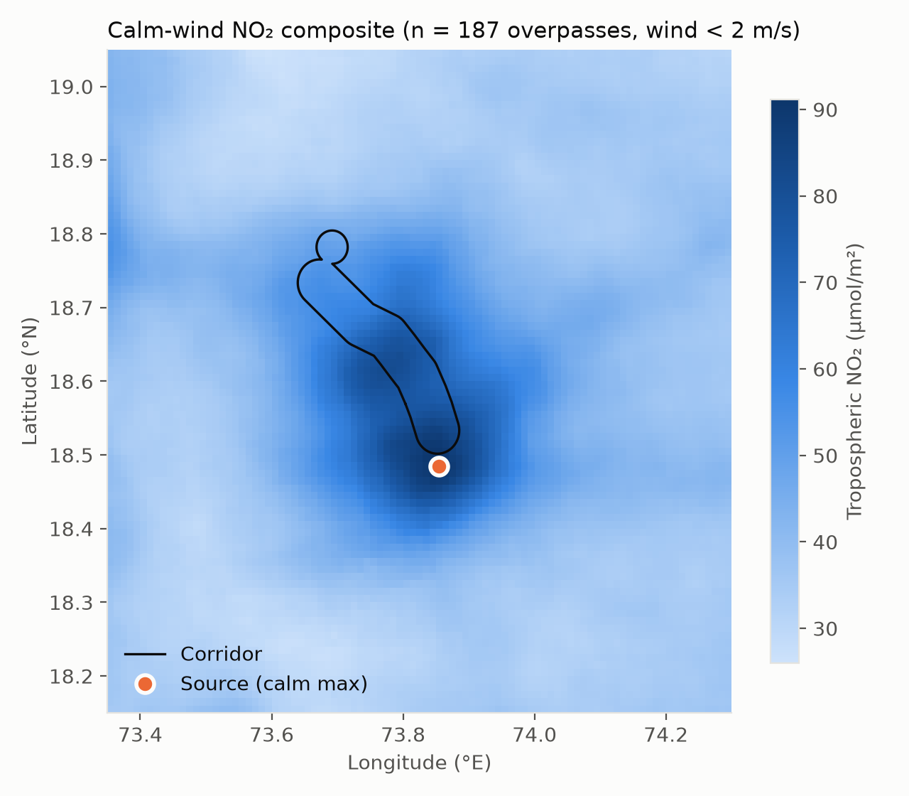

### 4.3 City-scale emission (EMG, the base paper's method)

Settings: IQR-filtered cube (D13), 850 hPa wind, overpasses with 2–8 m/s wind, Differential Evolution (population 300, F ∈ [0.5, 1.0], CR = 0.7), 200-member bootstrap over overpasses, NOx/NO₂ = 1.32.

| Run | n | E(NOx) kg/s [95% CI] | ≈ kt/yr* | τ (h) [95% CI] | x₀ (km) | w (m/s) | R² |
|---|---|---|---|---|---|---|---|
| **Main: all windy days** | **781** | **0.522 [0.486–0.555]** | **16.5** | **1.67 [1.55–1.81]** | 25.0 | 4.14 | 0.991 |
| Easterly regime (from 45–180°) | 429 | 0.561 [0.521–0.604] | 17.7 | 1.42 [1.31–1.54] | 21.5 | 4.22 | 0.990 |
| Westerly regime (from 225–360°) | 276 | 0.442 [0.388–0.494] | 14.0 | 2.18 [1.86–2.54] | 33.8 | 4.31 | 0.979 |
| Wind 2–4 m/s | 416 | 0.478 [0.437–0.511] | 15.1 | 1.97 [1.80–2.13] | 21.4 | 3.01 | 0.994 |
| Wind 4–8 m/s | 365 | 0.506 [0.464–0.546] | 16.0 | 1.62 [1.47–1.82] | 31.8 | 5.44 | 0.985 |
| Wind at 100 m | 782 | 0.456 | 14.4 | 1.82 | 25.7 | 3.92 | 0.981 |
| Wind at 10 m | 675 | 0.347 | 11.0 | 2.35 | 27.9 | 3.31 | 0.977 |

\* *Midday emission rate multiplied by one year; not an annual total (no night-time or monsoon data).*

- **The wind level is the largest single sensitivity.** Surface (10 m) wind is too slow to represent a plume ~1 km deep, which is why 850 hPa is the physically preferred choice.
- The two regimes differ by ~23%. The westerly regime has fewer overpasses and a longer lifetime.
- **Differential Evolution settings (proposal step 4):** the main fit was repeated for 36 combinations: population 150 / 300, F = [0.5, 1.0] dithered / 0.5 / 0.9, CR = 0.3 / 0.7 / 0.9, two seeds. **All converged to the same optimum**: E(NOx) 0.5220 kg/s and τ 1.672 h, spread < 0.001%. The result doesn't depend on the optimiser settings (`outputs/phase1/de_sensitivity.json`, `figures/de_sensitivity.png`).
- **Misfit:** the line density rises again 50–60 km downwind. In east-southeast winds that direction is up the corridor, so this is PCMC and Talegaon appearing as additional sources that a single-source fit cannot separate.

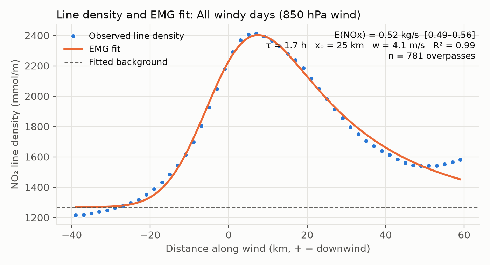
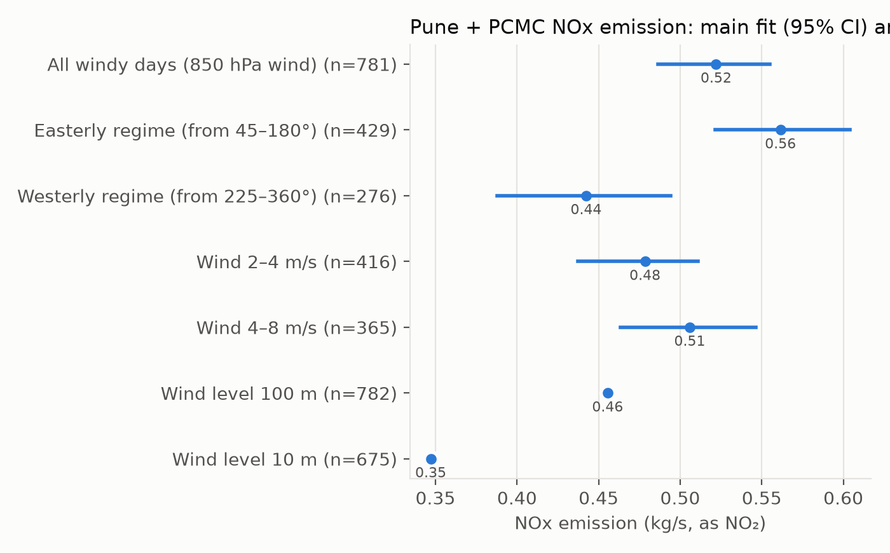

### 4.4 Spatial attribution (flux divergence)

Settings: 968 overpasses (wind ≤ 8 m/s), IQR-filtered, 850 hPa wind, lifetime 1.67 h from EMG, background = 10th percentile of the mean column (2.96 × 10⁻⁵ mol/m²), 200-member bootstrap.

**Two distinct hotspots, 16.7 km apart:**

| Hotspot | Location | Within 4 km | Within 6 km | Within 8 km |
|---|---|---|---|---|
| Central Pune | 18.485 N, 73.855 E (outside the corridor) | 0.047 | 0.091 | 0.147 kg/s |
| **Pimpri–Chinchwad** | **18.625 N, 73.795 E (inside the corridor)** | 0.034 | 0.069 | 0.112 kg/s |

The Pune hotspot sits exactly where the EMG placed its source. The PCMC peak reaches 73% of Pune's intensity.

**Zone totals** (NOx, kg/s, 95% bootstrap CI):

| Zone | Pixels (~km²) | Emission | ≈ kt/yr* |
|---|---|---|---|
| Pune core (≤ 10 km from source, outside the corridor) | 222 | 0.168 [0.162–0.176] | 5.3 |
| C1 Shivajinagar–Kasarwadi | 77 | 0.058 [0.056–0.061] | 1.8 |
| C2 PCMC | 55 | 0.037 [0.035–0.039] | 1.2 |
| C3 Dehu Road–Talegaon | 97 | 0.025 [0.023–0.028] | 0.8 |
| **Whole corridor** | 229 | **0.120 [0.116–0.125]** | **3.8** |

Corridor pixels are assigned to the cluster of their nearest waypoint, so zones don't overlap. The corridor zones are only 1–2 TROPOMI pixels wide, so some emission smears across zone edges. The equal-radius hotspot circles above are the fairer Pune-vs-PCMC comparison.

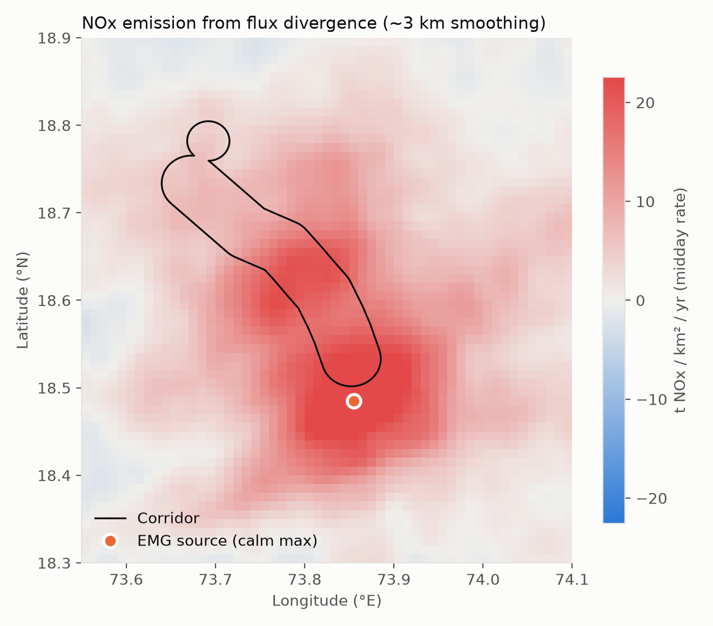
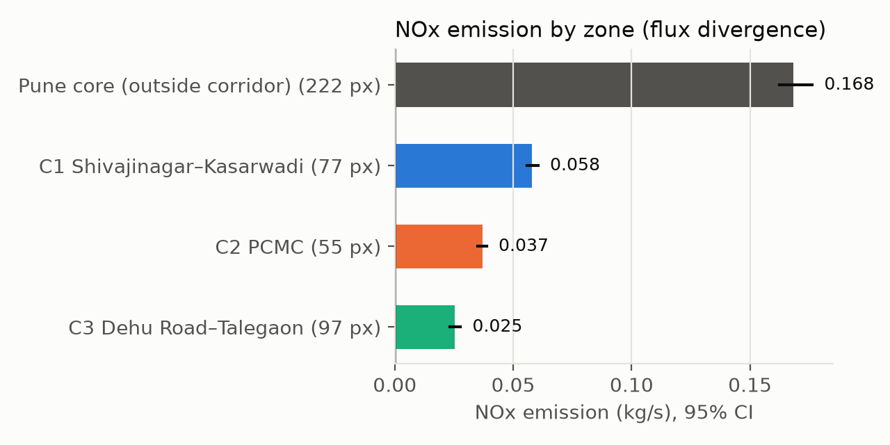

### 4.5 Do the two methods agree?

| Radius around source | 5 | 10 | 15 | 20 | **25** | 30 | 35 km |
|---|---|---|---|---|---|---|---|
| Flux divergence (kg/s) | 0.068 | 0.204 | 0.341 | 0.467 | **0.570** | 0.643 | 0.699 |

- **At 25 km, flux divergence (0.57 kg/s) agrees with EMG (0.52 kg/s) within 9%**, and both put the main source at the same pixel.
- **Unlike the synthetic test, the real total doesn't level off with radius.** Splitting it into its two terms:
  - the **flux term** levels off at ~0.16 kg/s, as expected;
  - the **lifetime (sink) term** keeps growing and is ~70% of the 25 km total. NO₂ 30–35 km out is still ~24% above the chosen background.
- **So absolute flux-divergence totals depend on the lifetime and the background choice**, while the spatial *pattern* does not:

| Sensitivity run | Corridor total (kg/s) | Corridor share of 25 km total | C2 / Pune core |
|---|---|---|---|
| Main | 0.120 | 0.211 | 0.219 |
| Lifetime × 0.7 | 0.156 | 0.210 | 0.228 |
| Lifetime × 1.3 | 0.101 | 0.212 | 0.213 |
| Lifetime ÷ 0.84 (synthetic-bias corrected) | 0.107 | 0.211 | 0.215 |
| Background 5th percentile | 0.124 | 0.208 | 0.220 |
| Background 25th percentile | 0.113 | 0.218 | 0.218 |
| Wind at 100 m | 0.119 | 0.218 | 0.231 |

**The absolute corridor total ranges −16% to +30%; the corridor share varies by only ±2.4%.** This is the basis for D10: the **city total comes from EMG**, and the **split between zones from flux-divergence shares**.

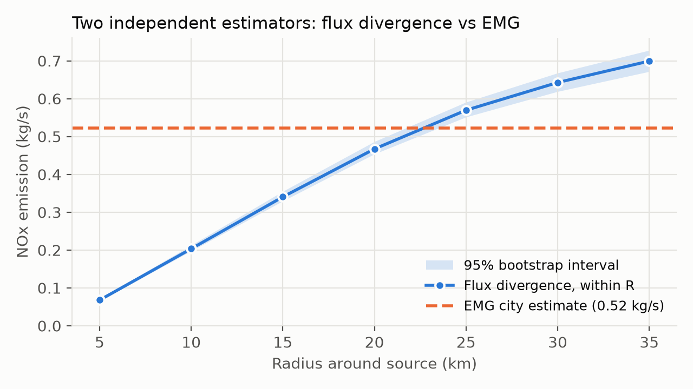

### 4.6 NOx → fossil CO₂ and comparison with inventories

**Inventories used** (clipped to the study box; roles per the proposal's design rule):
- **EDGAR v8.1 NOx + v8.0 fossil CO₂.** Both share the FT2022 activity data; 0.1° annual grids, 2019–2022 totals, all sectors for 2021. **Role: source of the CO₂:NOx ratio (a prior) and a plausibility comparison.**
- **ODIAC v2024.** 1 km monthly grid, 35 October–May months to December 2023. **Units: tonnes of carbon per cell per month** (US GHG Center documentation), converted ×44/12. **Role: plausibility comparison only**. It spreads emissions using nighttime lights, so it isn't independent of VIIRS.

**Comparison area:** within 25 km of the source, where the two satellite methods agree (§4.5).

**NOx: satellite vs EDGAR**

| | NOx (kt/yr) |
|---|---|
| Satellite (EMG, midday rate) | **16.5** [95% CI 15.4–17.5] |
| EDGAR v8.1 (2019–2022 mean) | 21.1 (2019 21.2 · 2020 20.4 · 2021 21.0 · 2022 21.7) |
| **Satellite / EDGAR** | **0.78** |

A midday rate would normally be *higher* than the daily mean (traffic and industry peak in the day), so the satellite being 22% lower suggests either EDGAR overestimates Pune's NOx, or the fitted background in the EMG absorbs diffuse emissions. **Not yet resolved.**

**The CO₂:NOx ratio (EDGAR, same area)**

| | 2019 | 2020 | 2021 | 2022 | Mean |
|---|---|---|---|---|---|
| t CO₂ per t NOx | 175.9 | 165.5 | 170.8 | 176.1 | **172.1** |

Excluding NOx with no fossil-CO₂ counterpart (agricultural soils and crop burning) gives 175.0. **By sector (2021) the ratio varies roughly threefold:**

| Sector (EDGAR 2021, within 25 km) | NOx (t) | CO₂ (t) | CO₂:NOx |
|---|---|---|---|
| Industry (combustion) | 13,479 | 1,548,077 | 115 |
| Road transport | 4,149 | 723,788 | 174 |
| Residential & commercial | 2,083 | 819,005 | 393 |
| Power generation | 580 | 164,583 | 284 |
| Aviation (landing/take-off) | 73 | 21,420 | 295 |
| Chemicals (CO₂ only) | 0 | 187,708 | – |

**So the city-wide ratio hinges on how much of Pune's NOx really comes from industry versus traffic and households.** That is exactly what the NO₂ data alone can't tell us, and why TROPOMI CO (D4) and OCO-3 (D8) matter.

**Fossil CO₂, Pune + PCMC within 25 km**

| Estimate | Fossil CO₂ (Mt/yr) |
|---|---|
| **Satellite (TROPOMI NO₂ × EDGAR ratio), midday rate** | **2.83 ± 32% (1σ) → 1.93–3.74** |
| EDGAR v8.0 (2019–2022 mean) | 3.63 |
| ODIAC v2024 (October–May months × 12) | 11.8 |

- The satellite CO₂ is **not independent of EDGAR**: it uses EDGAR's ratio. It differs from EDGAR only because the satellite NOx is 22% lower.
- **ODIAC is 3.2× EDGAR in the same area.** A plausible explanation (to be checked) is ODIAC's nighttime-light-based allocation concentrating emissions in brightly lit cities. Inventory disagreement of this size at city scale is itself a finding.

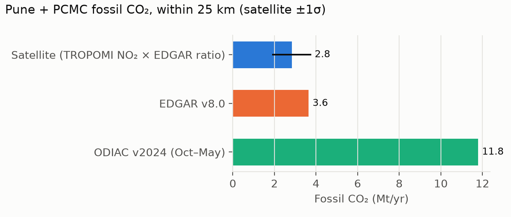

**Zones (city CO₂ × flux-divergence share, D10)**

| Zone | Share of city | Satellite CO₂ (Mt/yr) |
|---|---|---|
| Pune core (outside the corridor) | 29.5% | 0.84 |
| C1 Shivajinagar–Kasarwadi | 10.1% | 0.29 |
| C2 PCMC | 6.5% | 0.18 |
| C3 Dehu Road–Talegaon | 4.5% | 0.13 |
| **Corridor** | **21.1%** | **0.60** |

Inventory corridor totals for comparison: EDGAR 1.15 Mt/yr, ODIAC 4.04 Mt/yr. The corridor extends beyond the 25 km circle toward Talegaon, so the shares don't sum to 100%.

**First uncertainty budget (relative, 1σ, root-sum-square)**

| Term | 1σ |
|---|---|
| EDGAR ratio representativeness (the base paper's value) | 25.0% |
| EMG method bias (synthetic test; systematic, kept uncorrected) | 12.0% |
| Wind regime (E-SE vs W-NW, half-difference) | 11.4% |
| NOx/NO₂ ratio (1.32 ± 0.1) | 7.6% |
| Wind level (850 hPa vs 100 m, half-difference) | 6.4% |
| EMG fit + sampling (bootstrap) | 3.3% |
| EDGAR ratio: year-to-year + combustion-only choice | 3.1% |
| **Total** | **31.9%** |

The 25% term comes from the base paper and **may be optimistic** here, given the sector ratios above. The OCO-3 mass-balance check (D8) is designed to test it directly.

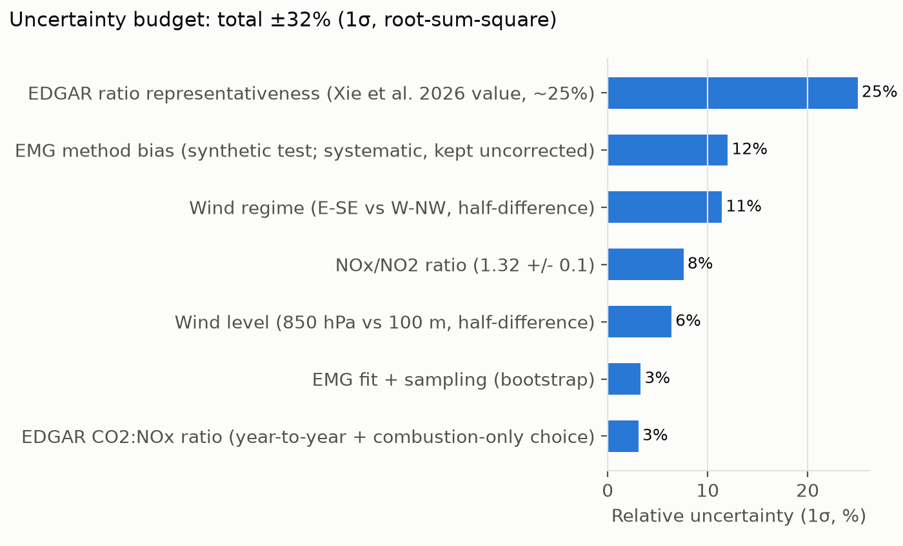

### 4.7 Independent check with OCO-3 / OCO-2 (D8, exploratory)

**Method (plume-model scaling).** For each of the 8 dates:
1. Take the flux-divergence emission map scaled to 2.83 Mt CO₂/yr.
2. Carry it downwind as a Gaussian column plume on that day's ERA5 850 hPa wind, at the OCO overpass hour.
3. Regress observed XCO₂ on the predicted enhancement, plus a linear regional gradient.

The slope β measures observed ÷ predicted: β = 1 means OCO agrees with our estimate, and β × 2.83 Mt/yr is an emission estimate **independent of EDGAR's CO₂:NOx ratio**.

| Date (IST) | Soundings | Wind (m/s, from) | Predicted max (ppm)* | β ± 1σ* |
|---|---|---|---|---|
| OCO-3 2019-10-14 08:52 | 167 | 8.9, 98° | 0.04 | 10.9 ± 5.8 |
| OCO-3 2020-04-21 15:31 | 208 | 7.0, 288° | 0.06 | −7.9 ± 3.9 |
| OCO-3 2020-12-20 15:16 | 890 | 6.1, 100° | 0.07 | −3.7 ± 1.8 |
| OCO-3 2020-12-24 13:42 | 917 | 3.7, 122° | 0.11 | 5.0 ± 0.8 |
| OCO-3 2021-01-01 10:34 | 252 | 4.8, 159° | 0.08 | 1.7 ± 3.9 |
| OCO-3 2022-01-27 14:03 | 397 | 3.2, 113° | 0.13 | −0.2 ± 0.9 |
| OCO-3 2022-11-21 16:04 | 247 | 2.9, 66° | 0.15 | −10.1 ± 1.8 |
| OCO-2 2024-01-23 13:51 | 230 | **0.6**, 106° | 0.41 | 1.16 ± 0.33 |

\* *With emissions confined to 10 km of the source. Spreading them over 25 km lowers the predicted maxima to 0.02–0.07 ppm.*

**Combined (inverse-variance, error inflated for between-date scatter):**

| Emission prior | β | Between-date χ² | 95% upper limit | 3σ detection threshold |
|---|---|---|---|---|
| Confined to 10 km | **1.02 ± 0.94** | 11.1 | E < 7.3 Mt/yr | ~8 Mt/yr |
| Spread over 25 km | 2.00 ± 1.81 | 14.3 | E < 14.1 Mt/yr | ~15 Mt/yr |
| 10 km, without the near-calm date | 0.65 ± 1.93 | 12.9 | E < 10.8 Mt/yr | – |

**What this means**
- **Not a detection.** The predicted plume is 10–20× smaller than the sounding scatter (0.5–1.1 ppm) and the **swath-to-swath stripes** visible on the Snapshot Area Map dates (retrieval artefacts of 0.5–1 ppm). The dates disagree with each other far more than their error bars allow.
- β ≈ 1 with the 10 km prior is **consistent with, not a confirmation of**, the NO₂-based estimate. It leans heavily on the one near-calm OCO-2 date, where a steady-state plume model is not valid.
- **EDGAR (β = 1.28) is consistent in every variant.** ODIAC (β = 4.16) is 3.3σ away with the 10 km prior but only 1.2σ with the 25 km prior: **a tentative, non-robust hint that ODIAC is too high for Pune.**
- **Answer to the research question for this corridor:** current CO₂ satellites give an *upper bound* on Pune's emissions, not an independent measurement, because Pune (~3–4 Mt/yr) is below the ~8–15 Mt/yr detection threshold of these 8 overpasses. The proposal's success criteria (§11) count this as a valid result.
- A possible improvement before finalising: per-swath offset terms in the regression, to absorb the stripe artefacts.

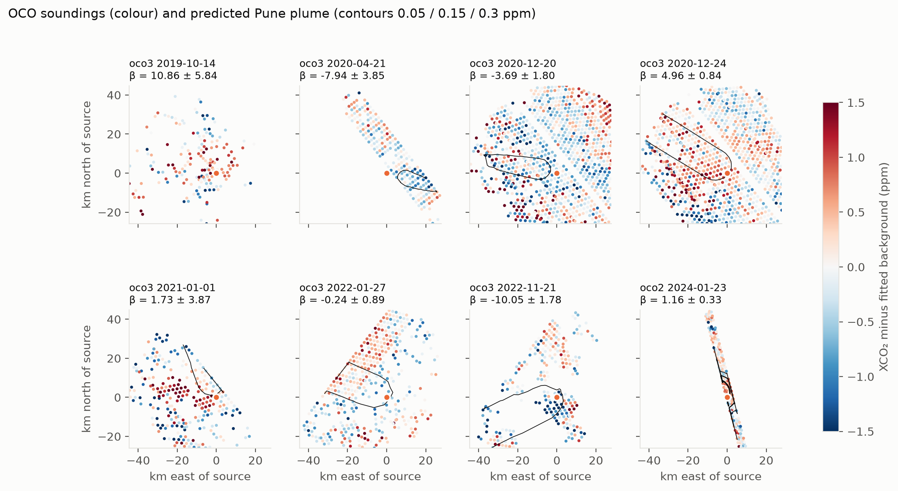
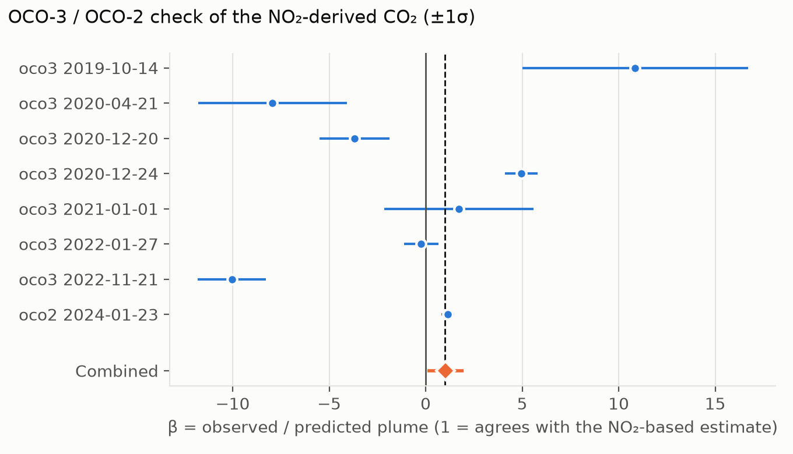

### 4.8 TROPOMI CO: constraining the sector mix and the CO₂:NOx ratio (D4)

**Why:** the NOx → CO₂ ratio was the largest error term (§4.6), and OCO could not test it (§4.7). Sectors differ strongly in how much CO they emit per NOx, so measuring Pune's CO:NOx tells us the sector mix, and with it which CO₂:NOx ratio applies.

**Data:** TROPOMI OFFL L3 CO via Earth Engine (pre-filtered qa > 0.5; solar zenith ≤ 70°), same 0.01° grid as NO₂: **907 overpasses**, 608 with 2–8 m/s wind. SRTM elevation on the same grid. EDGAR v8.1 CO (totals 2019–2022, sectors 2021).

**The terrain problem.** A CO column measures all the air above the ground. The Pune plateau (~560 m) and the Konkan lowlands (~0 m) differ by ~6% in air mass, **more than Pune's own CO signal (~2%)**; the raw January mean peaked over the Konkan, not Pune.

**Method (robust to terrain):**
1. Divide each column by the relative air mass, exp(−z/H) with H = 8.4 km, using elevation smoothed to the ~5 km CO footprint.
2. Remove each day's box median.
3. **Remove each pixel's long-term mean.** Anything fixed in space disappears, including residual terrain and the city's direction-averaged CO dome.
4. Rotate each day by its wind. The downwind-minus-upwind line density (20–40 km windows) equals the full step, so E(CO) = step ÷ ⟨1/w⟩.

**Synthetic test** (`tests/test_co_step.py`): an inert source of 100 mol/s with a static terrain pattern *larger than the plume* is recovered as **98.6 mol/s (−1.4%)**; **terrain alone gives −0.8 mol/s (≈ 0)**.

**Result:**

| | Value |
|---|---|
| CO step (downwind − upwind line density) | 65.0 mol/m |
| **E(CO)** | **6.73 kg/s** |
| **CO:NOx emission ratio** (NOx from EMG) | **21.2 mol/mol [95% CI 18.7–23.8]** |
| EDGAR CO:NOx, same 25 km area | 16.0 mol/mol → **observed is 33% higher** |

| Sensitivity | CO:NOx |
|---|---|
| Scale height 7.5 / 9.5 km | 21.4 / 21.0 |
| No terrain correction | 19.5 |
| October–January only | 22.0 |
| February–May only (fire season) | 20.5 (no sign of fire inflation) |

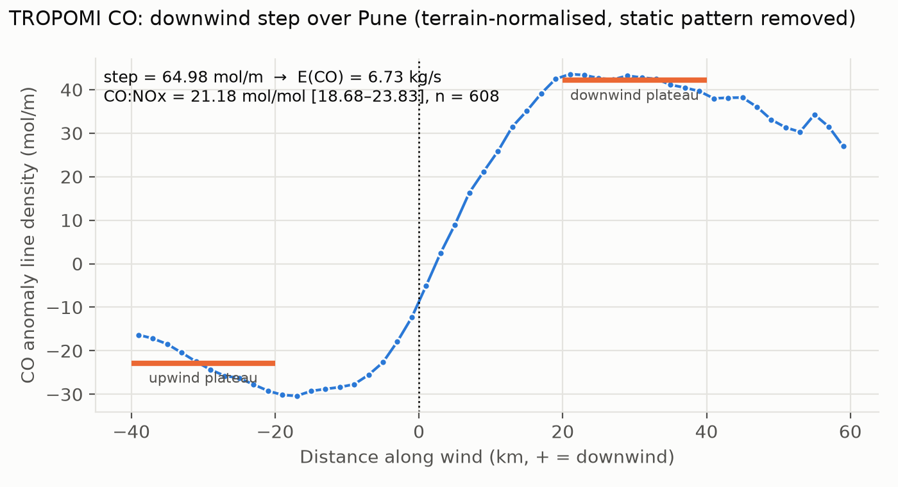

**What the excess CO means (EDGAR 2021 sector ratios, same area):**

| Sector | CO:NOx (mol/mol) | CO₂:NOx (t/t) | EDGAR share of NOx |
|---|---|---|---|
| Industry | 9.9 | 115 | 64% |
| Road transport | 1.95 | 174 | 20% |
| Residential & commercial | 77.9 | 393 | 10% |
| Power | 0.38 | 284 | 3% |

Re-splitting one sector pair at a time (all others held at EDGAR shares) to match the observed 21.2:

| Scenario | Feasible? | Implied change | CO₂:NOx [95%] |
|---|---|---|---|
| A: high-CO group (residential + crop burning) vs rest | yes | high-CO share of NOx 18.5% (EDGAR 11%) | 188 [179–197] |
| B: industry vs transport | **no** (needs 154% industry) | – | – |
| C: residential vs industry | yes | residential 24% of pair (EDGAR 13%) | 181 [171–192] |
| D: residential vs transport | yes | residential 57% of pair (EDGAR 33%) | 174 [167–182] |

- **The excess CO can't come from industry replacing transport.** It needs more high-CO (residential/biomass-type) combustion than EDGAR assumes.
- **CO-constrained CO₂:NOx = 181 (95% range 167–197)**, against EDGAR's 172 and an unconstrained sector span of 115–393.

**Revised CO₂ estimate and uncertainty budget (proposed D12):**

| | EDGAR ratio (§4.6) | **CO-constrained ratio** |
|---|---|---|
| CO₂:NOx | 172 | **181** (167–197) |
| City fossil CO₂ (midday rate) | 2.83 Mt/yr | **2.98 Mt/yr** (1σ 2.28–3.69) |
| Total uncertainty (1σ) | 31.9% | **23.6%** |

In the revised budget, the base paper's 25% "ratio representativeness" term becomes **8.1%** (half-range of the feasible scenarios) **+ 10%** (assumed, for EDGAR's per-sector ratios). The other terms are unchanged (bootstrap 3.3%, wind level 6.4%, wind regime 11.4%, EMG bias 12%, NOx/NO₂ 7.6%, EDGAR year/choice 3.1%). **Adding TROPOMI CO cuts the dominant error term by about two thirds.** This is the clearest answer yet to the primary research question.

**Caveats:**
- The mixing model trusts EDGAR's per-sector CO:NOx and CO₂:NOx ratios, and re-splits only one pair at a time.
- Secondary CO from VOC oxidation in the plume, and the EMG's +12% NOx bias, would both make the true CO:NOx *higher*, pushing toward more residential share and a higher CO₂:NOx.
- EDGAR gives Indian road transport a low CO:NOx (1.95); whether that's realistic is itself an inventory assumption.
- Residential CO₂ here is fossil only (EDGAR's framing); biomass CO₂ is biogenic and excluded.

### 4.9 What Phase 1 has *not* yet produced

**Items against the proposal's own Phase 1 definition** (checked 2026-09-24):
- ✅ **IQR outlier removal** of TROPOMI NO₂ (proposal step 1): done (D13). Per-pixel time series, Tukey k = 3; removes 0.09% of pixels; every result moved < 2%.
- ✅ **Differential Evolution settings sensitivity test** (proposal step 4): done. 36 combinations, identical optimum (spread < 0.001%).
- ⬜ **Phase 1 report** (proposal deliverable): not yet written; `findings.md` is the running results record, not the report.
- Per-sub-zone line-density plots were replaced by cluster-scale flux divergence (D1, D10). This is a documented deviation, not an omission.

**Other gaps:**

- No *direct* observational test of the CO₂:NOx ratio (OCO couldn't provide one, §4.7). TROPOMI CO constrains it indirectly through EDGAR's sector ratios (§4.8).
- No diurnal or seasonal adjustment between the midday October–May satellite rate and the annual inventories.
- The Monte Carlo version of the uncertainty budget.

---

## 5. Design decisions so far

| # | Decision | Driven by |
|---|---|---|
| D1 | Invert NO₂ over 3 clusters, not 10 waypoints | Waypoints closer together than one TROPOMI pixel |
| D2 | Layers used to build CO₂ labels are excluded from model features | Avoids a circular "Experiment D always wins" result |
| D3 | OCO-3 as an independent observed target | Later narrowed by D8 |
| D4 | Add TROPOMI CO as a source-type tracer | No ground truth separating traffic from industry |
| D5 | Tree models + spatial-block CV + bootstrap CIs; drop the U-Net | ~270 cells × 40 months is too little for deep learning |
| D6 | ERA5 hourly as the primary meteorology | Resolution; overpass-time matching |
| D7 | October 2019 – May 2024, October–May only | TROPOMI pixel change (Aug 2019); monsoon cloud |
| D8 *(proposed)* | OCO-3 (7 dates) + OCO-2 (1 date) as a city-scale mass-balance check on NO₂-derived CO₂ | G1: too sparse for ML, but direct CO₂ |
| D9 | Corridor = highway centreline ± 3.5 km + Talegaon MIDC | G4: waypoint errors up to 4.4 km; MIDC outside |
| D10 | City total from EMG; spatial split from flux-divergence shares | Phase 1: FD totals sensitive, FD shares robust |
| D11 *(proposed)* | OCO gives consistency + an upper limit + a detection threshold, not an independent estimate | D8 run: no detection (plume ≪ noise and swath artefacts) |
| D12 *(proposed)* | CO₂:NOx from the TROPOMI-CO-constrained sector mix (181, 167–197); headline 2.98 Mt/yr ± 24% | D4 run: CO:NOx 21.2 vs EDGAR 16.0 |
| D13 | IQR outlier removal = per-pixel time series, k = 3 | "local" removed 29% of real pixels (L3 oversampling); "domain" clips the plume |

Full reasoning for each is in [decisions.md](decisions.md).

---

## 6. Processing notes (for the Methods chapter)

- **GES DISC access:** the account needs the "NASA GESDISC DATA ARCHIVE" application approved; "GESDISC Test Data Archive" is a different (test) server.
- **OCO-2 versions:** the newest version (11.3r) covers only 2024, so the scan takes the newest version available **per day** (11.2r for 2019–2023). Selecting a single version silently dropped four of the five seasons in the first attempt.
- **OCO-3 operation mode** codes used here: 0 nadir, 1 glint, 2 target, 3 transition, 4 Snapshot Area Map. *To confirm against the Lite file's attribute documentation before publication.*
- **Network outage:** 159 OCO-2 days failed during a DNS outage and were re-scanned successfully. A restarted OCO-3 run logged 41 days twice; the summaries count distinct days.
- **TROPOMI cube:** 1,004 usable overpasses, reprojected to one fixed 0.01° grid (90 × 95 pixels, 73.35–74.30 E, 18.15–19.05 N); 89% of pixel-days valid. ERA5 matched to every overpass within 30 minutes.
- **GEE L3 oversampling:** GEE's 1 km TROPOMI L3 grid copies each ~3.5 × 5.5 km pixel into several cells. Any per-pixel spatial statistic (e.g. a local IQR filter) therefore sees footprint edges, not independent pixels; a local filter removed 29% of real pixels and was rejected (D13).
- **ERA5 resolution:** C2 and C3 fall in the same 0.25° cell, so the corridor effectively has one wind per overpass. Flux divergence uses this as a uniform wind over the box (a stated approximation).

---

## 7. Limitations and open issues

| Issue | Effect | Status / mitigation |
|---|---|---|
| EMG synthetic bias (+12% E, −16% τ) | City total likely slightly high | Measured; enters the uncertainty budget |
| Flux-divergence totals depend on lifetime and background | Absolute zone totals ±25% | Use shares (±2.5%), not absolute FD totals (D10) |
| Wind-level choice | 0.35–0.52 kg/s across 10 m / 100 m / 850 hPa | 850 hPa justified physically; reported as a sensitivity |
| Corridor zones are 1–2 TROPOMI pixels wide | Emission smears across zone edges | Hotspot circles as a cross-check |
| Uniform wind over the box in flux divergence | Local wind variations ignored | Stated approximation; ERA5 can't resolve finer |
| Central Pune (the largest source) lies outside the corridor | Corridor results include transported Pune NO₂ | Explicit Pune-core zone; regime split |
| Chakan industrial area outside the corridor to the NE | Possible upwind contamination on NE-wind days | To note; could be tested by wind direction |
| Midday, October–May only | "kt/yr" figures are not annual totals | Always labelled "midday rate" |
| Fixed NOx/NO₂ = 1.32 | Scales all NOx values | Literature value; ±0.1 in the budget (7.6%) |
| NOx → CO₂ ratio (EDGAR 172; sectors 115–393) | Was the largest error term (25%) | **Constrained by TROPOMI CO to 167–197 (D12)**; still relies on EDGAR's per-sector ratios (assumed 10%) |
| Satellite NOx 22% below EDGAR | Either EDGAR is high or the EMG background absorbs diffuse sources | Open; check with a sloped-background fit and FD totals |
| EDGAR and ODIAC disagree by 3.2× | Inventory "plausibility" range is very wide | Report both; don't treat either as truth |
| Midday October–May rate vs annual inventories | Not like-for-like | Diurnal/seasonal profiles to be applied |
| OCO-3/OCO-2 can't detect the Pune plume | No *direct* test of the CO₂:NOx ratio | Upper limit only (D11); ratio constrained indirectly via TROPOMI CO (D12) |
| TROPOMI CO terrain imprint (~6%) larger than Pune's signal | Could fake or hide the CO step | Air-mass normalisation + static-pattern removal; synthetic test −1.4% / ≈0 with terrain only |
| Secondary CO (VOC oxidation) and EDGAR's per-sector ratios | CO:NOx → CO₂:NOx mapping | Both push toward a higher ratio; 10% term assumed |
| D8 not yet approved | Changes Experiment B's meaning | **Awaiting guide review** |

---

## 8. Next steps

1. **Write the Phase 1 report** (the last open Phase 1 deliverable).
2. **Discuss D8/D11/D12/D13 with the guide.** OCO: non-detection with an upper limit. CO: constrained ratio, headline 2.98 Mt/yr ± 24%.
3. **Diurnal/seasonal adjustment** of the satellite midday rate before comparing with annual inventories (EDGAR temporal profiles).
4. **Monte Carlo version of the uncertainty budget** (the current one is root-sum-square with independent terms).
5. **Phase 2 data layers** on the 1 km grid: VIIRS, OSM roads, Sentinel-2 NDBI/NDVI (TROPOMI CO, EDGAR and ODIAC are already downloaded).
6. **Optional:** per-swath offsets in the OCO regression; a sloped background in the EMG fit (the residuals at both ends suggest a regional gradient); a wider across-wind window for the CO step.

---

## 9. How to reproduce

```powershell
.venv\Scripts\activate
# Feasibility
python -m ecotrack.feasibility.g4_verify_waypoints ; python -m ecotrack.feasibility.g4_map
python -m ecotrack.feasibility.g2_tropomi_coverage
python -m ecotrack.feasibility.g3_no2_signal
python -m ecotrack.feasibility.g1_oco_soundings --product oco3   # likewise --product oco2
python -m ecotrack.acquire.era5_overpass
# Phase 1
python -m ecotrack.acquire.tropomi_cube
python -m ecotrack.inversion.run_city
python -m ecotrack.inversion.run_divergence
python -m ecotrack.acquire.edgar ; python -m ecotrack.acquire.odiac
python -m ecotrack.inversion.run_co2
python -m ecotrack.inversion.run_oco_check ; python -m ecotrack.inversion.run_oco_check --prior-radius 10 --tag _r10
python -m ecotrack.acquire.tropomi_cube --product co ; python -m ecotrack.acquire.dem
python -m ecotrack.inversion.run_co_ratio
python -m ecotrack.inversion.de_sensitivity
# Method tests
python -m pytest
```

| Output | File |
|---|---|
| Feasibility summaries | `outputs/feasibility/g1_*_summary.json`, `g2_tropomi_summary.json`, `g3_no2_signal.json`, `g4_waypoints.json` |
| First-corridor results (before D9) | `outputs/feasibility/v1_waypoint_corridor/` |
| EMG results | `outputs/phase1/city_fit.json` |
| Flux-divergence results and map | `outputs/phase1/divergence_totals.json`, `divergence_map.npz` |
| CO₂ conversion, inventory comparison, uncertainty budget | `outputs/phase1/co2_summary.json` |
| OCO check (D8) | `outputs/phase1/oco_check.json`, `oco_check_r10.json` |
| TROPOMI CO ratio, sector scenarios, revised budget (D4/D12) | `outputs/phase1/co_ratio.json` |
| DE settings sensitivity (36 fits) | `outputs/phase1/de_sensitivity.json` |
| Phase 1 results before IQR filtering (for comparison) | `outputs/phase1/v1_before_iqr/` |
| Figures | `outputs/phase1/figures/` |
| Feasibility memo for the guide | [feasibility_memo.md](feasibility_memo.md) |
