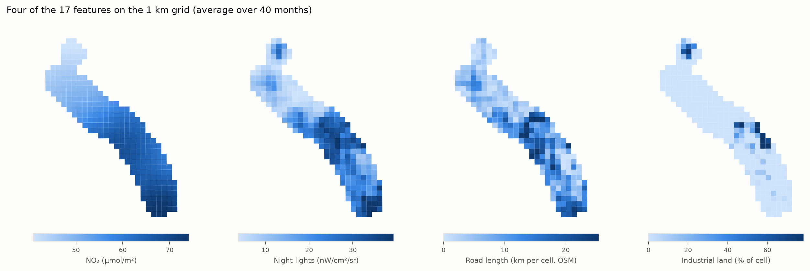
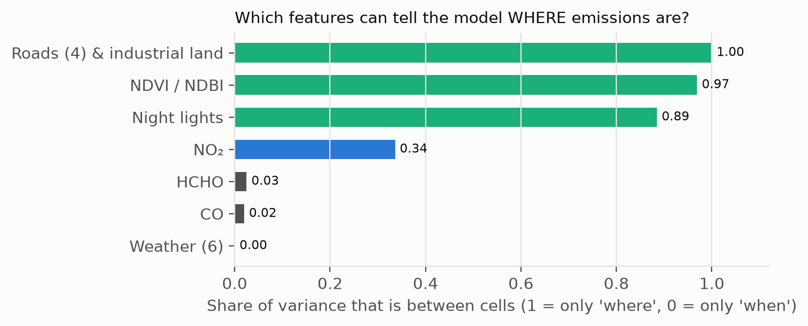

# EcoTrack — Phase 2 Report
## The multi-source 1 km feature table for the Shivajinagar → Talegaon Dabhade corridor

**Project:** Meteorology-informed multi-source satellite estimation of urban fossil-fuel CO₂, Shivajinagar → Talegaon Dabhade corridor, Pune
**Author:** Janhavi Tupe · **Phase:** 2 of 8 (proposal weeks 3–6) · **Date:** 2026-10-04
**Status:** complete. Deliverable: `data/processed/feature_table_v2.csv` (frozen, SHA-256 recorded). No Phase 2 decision awaits sign-off; Phase 3 waits on D16 (§8).

---

## Summary

Phase 2 put every data layer onto one 1 km grid over the corridor and assembled the **frozen multi-source feature table** that the machine-learning phases (4–6) will use. This is the proposal's Phase 2 deliverable.

**The deliverable:** feature table **v2**.
- **10,720 rows** = 268 cells × 40 months (October–May, 2019–2024).
- **17 features, 0 missing values.**
- Inventories (EDGAR, ODIAC) are carried as reference columns only, never as features (D2).
- GRIP4 roads are kept as cross-check columns.
- The CSV's SHA-256 is stored in the meta file; a rebuild reproduced it exactly.

**Key findings**
1. **All five proposal steps are done:**
   - OCO-3 checked in week 1 (G1, D8/D11);
   - VIIRS, OSM roads and Sentinel-2 NDVI/NDBI acquired;
   - EDGAR and ODIAC clipped;
   - the 1 km grid built and every layer put on it;
   - QA done (missing-data audit, histograms, spot checks).
2. **OpenStreetMap is far better than the fallback for local roads.** The OSM query servers failed for days. The same data was obtained as one bulk file (Geofabrik) and read locally in 2.5 minutes. GRIP4 agrees on major roads (Spearman 0.84) but has almost no local streets: median 0.07 vs 4.2 km per cell.
3. **A new feature, industrial-land fraction**, picks out MIDC Bhosari (97% industrial), Chinchwad/Akurdi and Talegaon MIDC. It is nearly independent of every other feature (|r| ≤ 0.4), so it carries new information.
4. **Which features can tell a model *where* emissions are?** The between-cell share of variance is:
   - roads, industry and land cover ~1.0;
   - night lights 0.89;
   - NO₂ 0.34;
   - **CO 0.02, HCHO 0.03**;
   - weather 0.

   At 1 km, CO, HCHO and weather describe *when*, not *where*. This is recorded **before** any model is trained. It shapes Experiment B and requires spatial cross-validation.
5. **NDBI does not behave as a built-up index here.** It is highest in the rural C3 cluster and correlates negatively with NO₂ (−0.28) and night lights (−0.33). Dry-season bare soil reflects short-wave infrared like concrete does. This is a known NDBI weakness, now documented as a caveat for interpreting Experiment D.

---

## 1. Objective

From the proposal (Phase 2, weeks 3–6): *"every additional data layer collected, QC'd, and ready for a common grid"*. Steps:
1. Acquire OCO-3 XCO₂ for the corridor; run the feasibility sounding count in week 1.
2. Acquire VIIRS night-time lights, the OSM road network, and Sentinel-2 NDBI/NDVI.
3. Acquire EDGAR and ODIAC, clipped to the corridor.
4. Build the 1 km × 1 km grid over the corridor polygon and rasterize every layer onto it.
5. QA the assembled dataset: missing-data audit, per-feature histograms, spot checks of 5–10 cells.

**Deliverable:** a complete, versioned, frozen multi-source feature table.

---

## 2. The grid (D15)

- **Projection:** UTM zone 43N (EPSG:32643), so a cell is truly 1 km × 1 km. In degrees, 0.01° of longitude is 1.05 km at Pune's latitude.
- **Cells:** 1 km squares aligned to whole kilometres, kept if **≥ 50% inside the corridor** (D9 polygon: highway centreline ± 3.5 km plus Talegaon MIDC).
- **Result:** **268 cells** covering 268 km², against a corridor of 269 km². Clusters: C1 Shivajinagar–Kasarwadi 91, C2 PCMC 63, C3 Dehu Road–Talegaon 114.
- **Per cell:** id, centre lat/lon and UTM, fraction inside the corridor, cluster (nearest waypoint), and distance to the Phase 1 source.
- **Files:** `data/interim/grid/cells.csv`, `cells.geojson` (`src/ecotrack/grid.py`).

---

## 3. Data layers and how each was put on the grid

| Feature | Source | Processing onto cells | Time step |
|---|---|---|---|
| `no2` | TROPOMI NO₂ cube (Phase 1, QC + IQR filtered, D13) | Monthly mean map, bilinear at the cell centre (cube pixels ~1.1 km, so a cell may contain no pixel centre) | monthly |
| `co_norm` | TROPOMI CO cube, terrain-normalised (÷ relative air mass, as in Phase 1) | same | monthly |
| `hcho` | TROPOMI HCHO (Earth Engine), cloud ≤ 0.3, SZA ≤ 70° | monthly mean, mean over the cell | monthly |
| `ws850`, `wd850`, `blh_m`, `frac_ese` | ERA5 at each overpass (Phase 1 file) | monthly mean; direction as a vector mean of u, v; `frac_ese` = share of days with wind from 45–180° | monthly, uniform over the corridor |
| `t2m_k`, `ssrd_j_m2` | ERA5 at 07 UTC (≈ overpass) | sampled at 1 km | monthly, ~uniform |
| `viirs_rad` | VIIRS DNB monthly, stray-light corrected; months without cloud-free coverage masked | mean over the cell | monthly |
| `ndvi`, `ndbi` | Sentinel-2 SR harmonized; clouds and shadows removed with the SCL band (keep classes 4–7); scenes < 60% cloud; seasonal median (40–47 scenes per season) | mean over the cell | seasonal |
| `road_major/mid/minor/total_km` | **OpenStreetMap**, Geofabrik extract `western-zone-261003.osm.pbf` | road length clipped to each cell in UTM; major = motorway/trunk/primary (+ links), mid = secondary/tertiary, minor = residential/unclassified/living street | static |
| `industrial_frac` | OpenStreetMap `landuse=industrial` (same file) | polygons merged (no double counting), intersected with each cell | static |
| `grip_road_*_km` (cross-check) | GRIP4 (Meijer et al. 2018), Earth Engine | lengths per class (types 1–2 / 3–4 / 5) | static |
| `ref_edgar_*`, `ref_odiac_*` (reference only) | EDGAR v8.0/v8.1 (0.1°, annual); ODIAC v2024 (1 km, monthly) | value of the containing cell; ODIAC converted from tonnes C to CO₂ | annual / monthly |

**Deliberately not features:**
- **OCO-3 XCO₂:** 8 dates in five years; Pune's plume is below detection (D11).
- **Inventories:** D2, reference columns only.

**Chemistry proxy (D14).** The proposal asked for reanalysis O₃/VOC fields (MERRA-2/CAMS). Those are ~50 km, and TROPOMI O₃ is a total column dominated by the stratosphere. TROPOMI **HCHO**, the standard satellite VOC indicator, plus ERA5 temperature and sunlight (the drivers of photochemistry) are used instead.

**QA counts behind each value:** NO₂ uses 6–32 overpasses per cell-month (median 25); CO 13+ (median 20).

---

## 4. The roads problem and its solution (D20)

1. **Overpass API** (`acquire/roads_osm.py`): 504/429 errors for days, on all three mirrors. Small tiles, disk caching, mirror rotation and lighter queries still left 16 of 35 tiles.
2. **Fallback for v1:** GRIP4 via Earth Engine (`acquire/roads_grip.py`), with its weakness stated: old sources (~2014) and sparse local roads.
3. **Solution for v2:** the **Geofabrik India western-zone extract**. One 221 MB file, MD5-verified, read locally with pyosmium (`acquire/osm_pbf.py`). It gave 36,082 road ways and 223 industrial areas in the box, in 2.5 minutes. The dated file also makes the snapshot reproducible.

**OSM vs GRIP4, per cell:**

| Class | OSM median (km) | GRIP4 median (km) | Spearman |
|---|---|---|---|
| major | 0.79 | 0.25 | 0.84 |
| mid | 1.08 | 0.88 | 0.70 |
| minor | **4.20** | **0.07** | 0.59 |
| total | 7.31 | 2.62 | 0.78 |

170 of 268 cells contain a major road (GRIP4: 145).

---

## 5. Results: the feature table

**`data/processed/feature_table_v2.csv`:** 10,720 rows × 35 columns. Every column is defined in [data_dictionary.md](data_dictionary.md).

| Column group | Columns |
|---|---|
| Lead (ID/context) | cell_id, month, season, lat, lon, cluster, frac_in_corridor, dist_to_source_km |
| 17 features | no2, co_norm, hcho, ws850, wd850, blh_m, frac_ese, t2m_k, ssrd_j_m2, viirs_rad, ndvi, ndbi, road_major_km, road_mid_km, road_minor_km, road_total_km, industrial_frac |
| QA | no2_n, co_n |
| Cross-check | grip_road_major/mid/minor/total_km |
| Reference only | ref_edgar_nox/co/co2_t_km2_yr, ref_odiac_co2_t_km2_month |

**Meta file** (`feature_table_v2.meta.json`): version, road source, OSM extract name, feature list, row/cell/month counts, **SHA-256 `de0200d6…`**.

**Per-cluster means (40 months):**

| Cluster | NO₂ (µmol/m²) | Night lights | Roads (km/cell) | Major roads | Industrial | NDVI | NDBI |
|---|---|---|---|---|---|---|---|
| C1 Shivajinagar–Kasarwadi | **67.2** | 24.4 | 10.5 | 1.86 | 4.6% | 0.33 | 0.00 |
| C2 PCMC | 64.5 | **27.4** | **14.6** | **2.26** | **10.4%** | 0.26 | 0.03 |
| C3 Dehu Road–Talegaon | 49.2 | 10.0 | 4.9 | 0.78 | 3.1% | 0.30 | **0.05** |

- NO₂ follows distance from the Pune source (C1 > C2 > C3), as in Phase 1.
- Activity layers peak in PCMC.
- Night lights grow steadily: median 15.6 (2019) → 23.6 (2024), +51%.



---

## 6. QA (proposal step 5, extended)

| Check | Result |
|---|---|
| Missing-data audit | **0 missing** in all 17 features and 4 reference columns |
| Per-feature histograms | All plausible (`outputs/phase2/qa_histograms_v2.png`). Weather columns are "steppy" (one value per month); EDGAR is blocky (~16 distinct values: 0.1° cells are bigger than ours) |
| Spot check | 8 random cells, January 2022 (`qa_feature_table_v2.json`) |
| Reproducibility | Rebuild → identical SHA-256 |
| **Correlation (new)** | Spearman; only expected pairs have \|r\| ≥ 0.8: minor/total roads 0.93; boundary layer/sunlight 0.90; temperature/sunlight 0.80; wind direction/east-wind fraction −0.84 |
| **Spatial variance share (new)** | See below |
| OSM vs GRIP4 (new) | §4 |


**Spatial variance share** (fraction of each feature's variance that lies between cells):

| Feature | Share | Meaning |
|---|---|---|
| roads, industrial_frac | 1.00 | static by construction |
| NDVI, NDBI | 0.97 | land cover |
| VIIRS | 0.89 | mostly spatial, plus a growth trend |
| NO₂ | 0.34 | two-thirds seasonal/weather |
| CO, HCHO | 0.02, 0.03 | almost purely temporal at 1 km |
| ERA5 weather | 0.00 | one ERA5 cell covers the corridor |



---

## 7. Deviations from the proposal

| Proposal | What was done | Why |
|---|---|---|
| Chemistry proxy: O₃/VOC from MERRA-2/CAMS | TROPOMI HCHO + ERA5 temperature and sunlight (D14) | Reanalysis is ~50 km; TROPOMI O₃ is mostly stratospheric |
| OCO-3 XCO₂ as a feature | Not a feature (D8/D11) | 8 dates; plume below detection |
| OSM roads via the API | OSM via a Geofabrik bulk file; GRIP4 fallback in v1 (D20) | Servers overloaded for days |
| Grid "over the corridor polygon" | UTM 43N, cells ≥ 50% inside (D15) | True 1 km cells; 268 km² of 269 |
| — | **Added:** industrial-land fraction | Named in the proposal's Phase 3 weights; needed for "industrial vs traffic" |
| — | **Added:** correlation and spatial-variance QA, SHA-256 freezing | Check redundancy and spatial information before ML; verifiable freeze |

---

## 8. Limitations

| Limitation | Effect | Handling |
|---|---|---|
| ERA5 is one 0.25° cell over the corridor | Weather identical for all cells in a month | Stated; weather can only explain timing |
| CO/HCHO barely vary between 1 km cells | No spatial skill from them | Documented before modelling; spatial CV |
| NDBI confused by dry bare soil | "Built-up" highest in rural C3; negatively correlated with NO₂ and VIIRS | Caveat for Experiment D; roads/industry/VIIRS are the reliable activity layers |
| OSM is a 2026 snapshot | Roads/industry built after 2019 counted for all years | Stated assumption; little change at 1 km over 5 years |
| OSM completeness varies | Industrial areas may be unmapped in places | Top cells match known MIDC estates |
| NO₂/CO interpolated from ~1.1 km pixels whose true footprint is ~3.5 × 5.5 km | Neighbouring cells are not independent | Spatial-block CV in Phases 4–6 |
| Inventory reference columns are coarse (EDGAR 0.1°) | Blocky reference | Reference only, never truth |

---

## 9. Implications for Phases 3–6

1. **Labels (Phase 3, D16)** can now be built on this grid: seasonal city CO₂ × flux-divergence share per cell (268 × 5 = 1,340 samples), plus the NO₂-independent CO label.
2. **Circularity (D2):** any proxy used to build a label must be removed from that experiment's features. The table keeps every layer separate so this is easy to enforce.
3. **Experiment B** (proposed as "+ TROPOMI CO") can improve temporal skill only, not spatial skill. This expectation is written down in advance.
4. **Experiment D:** the activity layers carry the spatial information, but NDBI is unreliable here. Its importance should be read with that caveat, and correlated features share importance.
5. **Evaluation:** spatial-block and cluster hold-out cross-validation are required (D5), because static features would otherwise let a model memorise cells.

---

## 10. Next steps

1. Guide sign-off on D16 (Phase 3 labels), plus the open Phase 1 decisions (D8, D11, D12, D19).
2. Phase 3: build labels L1 (NO₂ flux divergence) and L-co (CO flux divergence) on the grid.
3. Phase 4: the feature tensor (standardisation; spatial-block folds; leave-one-season-out).

---

## Appendix A — Reproducibility

```powershell
.venv\Scripts\activate
python -m ecotrack.grid                       # 268 cells
python -m ecotrack.acquire.grid_layers_gee    # VIIRS, HCHO, ERA5 t2m/ssrd (monthly); Sentinel-2 NDVI/NDBI (seasonal)
python -m ecotrack.acquire.roads_grip         # GRIP4 roads (cross-check)
# download the Geofabrik extract (check the .md5):
#   curl -L -o data/raw/osm/western-zone-<date>.osm.pbf https://download.geofabrik.de/asia/india/western-zone-latest.osm.pbf
python -m ecotrack.acquire.osm_pbf            # OSM roads + industrial land
python -m ecotrack.features                   # feature table v2 + QA
python -m pytest                              # 13 tests
```

Needs the Phase 1 cubes (`acquire.tropomi_cube`, `--product co`), `acquire.dem`, `acquire.era5_overpass`, `acquire.edgar` and `acquire.odiac`. All settings live in `configs/study.yaml` (`phase2:` section).

| Output | File |
|---|---|
| Grid | `data/interim/grid/cells.csv`, `cells.geojson` |
| Layers | `data/interim/grid/layers_monthly.csv`, `layers_seasonal.csv`, `layers_roads.csv`, `layers_roads_grip.csv`, `layers_landuse.csv`, `osm_source.json` |
| **Feature table v2** | `data/processed/feature_table_v2.csv` + `.meta.json` |
| Feature table v1 (earlier freeze, GRIP4 roads) | `data/processed/feature_table_v1.csv` + `.meta.json` |
| QA | `outputs/phase2/qa_feature_table_v2.json`, `qa_histograms_v2.png`, `qa_correlation_v2.png` |

## Appendix B — Supporting documents
- [data_dictionary.md](data_dictionary.md): every column.
- [decisions.md](decisions.md): D14, D15, D20 (and D2, D5, D11).
- [findings.md](findings.md) §4b: Phase 2 findings in full.
- [research_log.md](research_log.md): day-by-day record, including every bug.
- [guide/12_phase2_feature_table.md](guide/12_phase2_feature_table.md): step-by-step explanation.

## References
- Meijer, J. R. et al. (2018). Global patterns of current and future road infrastructure. *Environ. Res. Lett.* 13, 064006 (GRIP4).
- Zha, Y., Gao, J. & Ni, S. (2003). Use of normalized difference built-up index in automatically mapping urban areas from TM imagery. *Int. J. Remote Sensing* 24, 583–594 (NDBI).
- De Smedt, I. et al. (2018). Algorithm theoretical baseline for formaldehyde retrievals from S5P TROPOMI. *Atmos. Meas. Tech.* 11, 2395–2426 (HCHO).
- Elvidge, C. D. et al. (2017). VIIRS night-time lights. *Int. J. Remote Sensing* 38, 5860–5879.
- Copernicus Sentinel-2 (ESA); ECMWF ERA5; OpenStreetMap contributors (ODbL), Geofabrik extracts; EDGAR v8 (JRC); ODIAC v2024.
