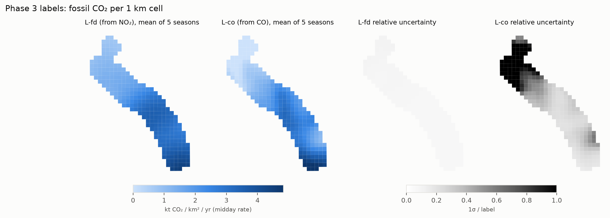
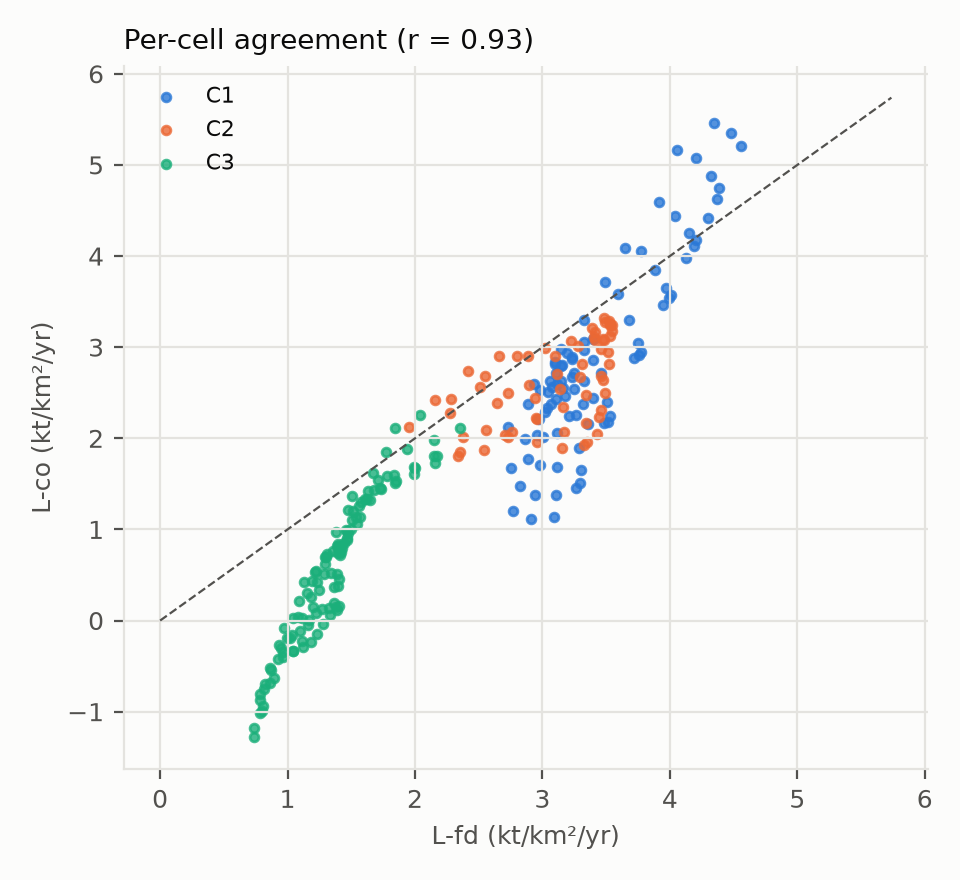

# EcoTrack — Phase 3 Report
## CO₂ labels for every 1 km cell and season

**Project:** Meteorology-informed multi-source satellite estimation of urban fossil-fuel CO₂, Shivajinagar → Talegaon Dabhade corridor, Pune
**Author:** Janhavi Tupe · **Phase:** 3 of 8 (proposal weeks 6–7) · **Date:** 2026-10-09
**Status:** labels v1 built and checked. **The design (D16) and one new decision (D21) await the guide's sign-off.** Switching the primary label is a one-line config change, not a rebuild.

---

## Summary

The ML phases need an answer to learn: fossil CO₂ for every 1 km cell and time step. No such measurement exists for Pune, so Phase 3 **constructs** labels from the Phase 1 satellite physics. The design goal is to avoid *circularity*: a model must not score well just because its inputs were used to build its answer.

**Deliverable:** `data/processed/labels_v1.csv`.
- **1,340 labels** = 268 cells × 5 seasons.
- Two labels per row, with a per-cell uncertainty for each.
- A meta file records the constants and a SHA-256 fingerprint.

| | **L-fd** (primary, D16) | **L-co** (independent check, D16/D21) |
|---|---|---|
| Built from | NO₂ flux-divergence map × seasonal city NOx (EMG) × CO₂:NOx 163 | CO flux-divergence map × multi-year city CO₂ |
| Varies by | cell and season | cell only (D21) |
| Median label | 2,374 t CO₂/km²/yr (midday rate) | 2,010 |
| Corridor share of the city | 20.7% | 14.3% |
| Median uncertainty (1σ, random) | 8% | 34% |
| **Noise ceiling** (best R² any model can reach) | **0.97** | **0.75** |
| Construction-linked features | NO₂ (+ winds) | CO (+ winds) |

**Key findings**
1. **The construction is verified.**
   - The rebuilt NO₂ emission map equals the Phase 1 map exactly.
   - The 268 cells reproduce the Phase 1 corridor shares (20.7% vs 21.0%; 14.3% vs 14.5%).
   - The results barely move with the smoothing scale (r ≥ 0.98 for 3 or 7 px).
2. **The two labels agree on *where*:** cell-level r = 0.93. They differ on *how much* falls in the corridor (20.7% vs 14.3%), mostly in rural C3, where CO's signal is weak.
3. **A fixed multi-year spatial pattern is justified for NO₂.** Each season's own map correlates r ≥ 0.98 with it. For CO, per-season maps are noisy (r 0.24–0.86).
4. **CO can't resolve season-to-season changes in the city's emissions.** Between-season spread ÷ within-season noise is **0.49** (NO₂: 2.8). Under the same rule Phase 1 used, L-co is therefore a **spatial-only** label (new decision D21).
5. **The circularity is real and measured.**
   - L-fd correlates 0.91 with the NO₂ feature, its construction input.
   - But **L-co, which never touches NO₂, still correlates 0.79 with NO₂.** NO₂ carries genuine emission information, not just the label's recipe.
   - This is the evidence the ablation needs (§6).
6. **Inventories, reference only.** ODIAC's *spatial pattern* matches both labels (Spearman 0.89) even though its *total* is 3.2× too high. EDGAR's coarse 0.1° blocks match less well (0.66 / 0.48).

---

## 1. Objective

From the proposal (Phase 3, weeks 6–7):
1. Redistribute Phase 1's CO₂ totals to 1 km cells.
2. Calibrate with OCO-3 where coverage allows.
3. Document the circularity risk.

**Changes, with reasons:**
- **Step 1 uses satellite emission maps instead of activity weights** (night lights, NDBI, roads). Activity weights would make Experiment D circular (D2).
- **Step 2 is not possible.** OCO can't detect Pune's plume (D11), so it gives no per-cell calibration.
- **Step 3 is done quantitatively** (§6), not just stated.

## 2. Design (D16) and the new decision D21

**L-fd** (primary):

  y(cell, s) = share_NO₂(cell) × E_NOx(s) × R

- **share_NO₂:** the cell's fraction of the NO₂ flux-divergence total within 25 km of the source. The multi-year map is smoothed to ~5 km (TROPOMI's real resolution) and sampled at the cell centre.
- **E_NOx(s):** the city NOx from the EMG fit for season s (0.434, 0.602, 0.733, 0.666, 0.663 kg/s). D10 applies: the EMG gives totals, flux divergence gives shares.
- **R:** the CO₂:NOx mass ratio constrained by TROPOMI CO, 162.7 (95%: 148–180; D12).

**L-co** (independent of NO₂):

  y(cell) = share_CO(cell) × C

- **share_CO:** from the CO flux-divergence map (terrain-normalised, static pattern removed), as in Phase 1.
- **C:** the multi-year city CO₂ (E_NOx × R). It is one constant, so NO₂ sets only the overall size, not the pattern or the timing.

**D21 (new, PROPOSED): L-co is spatial-only.**
- **Planned:** scale L-co by each season's CO total, so its time variation would also come from CO.
- **Tested:** those totals are 226, 258, 232, 266 and 261 mol/s, with ±28–48 uncertainty each.
- **Rule:** the same one Phase 1 used to accept seasonal NOx. The between-season spread must exceed the within-season noise; NO₂ gives 2.8.
- **Result:** CO gives **0.49**, so its "seasonal changes" are noise.
- **Decision:** use the multi-year CO total for every season (config `phase3.co_seasonal_scale: false`). The seasonal version is still computed and recorded in the QA file.

**Units.** Labels are in t CO₂/km²/yr as the **midday October–May rate**, which is what the satellite observes. The `_annual` columns divide by F = 1.214 (D17).

**Uncertainty.** `label_*_sd` is the *random* part. It comes from 200 (NO₂) or 100 (CO) bootstrap resamples of the overpasses, which give the share, plus the season-total uncertainty for L-fd. The *common-scale* uncertainty is a single factor shared by every cell, so it doesn't change which cells are high or low. It is listed in the meta file: ratio 5.1%, NOx/NO₂ 7.6%, EMG bias 12%.

## 3. Checks

| Check | Result |
|---|---|
| Rebuilt NO₂ map = Phase 1 `divergence_map.npz` | **exact** |
| Corridor share from cells vs pixels | L-fd 20.7% vs 21.0%; L-co 14.3% vs 14.5% (smoothing spreads a little across the corridor edge) |
| Smoothing 3 / 7 px vs 5 px | L-fd r 0.999 / 0.999; L-co r 0.979 / 0.986; shares within 0.4 points |
| Per-season maps vs multi-year pattern | NO₂ r 0.98–0.99 every season; CO r 0.24–0.86 |
| CO seasonal totals resolvable? | between/within **0.49** → not resolvable (D21) |
| Negative labels | L-fd 0%; L-co 11.6%, all in rural C3, where the uncertainty exceeds the value (zero within noise; kept, because clipping would bias upward) |
| Unit conversion and total conservation | `tests/test_labels.py` (2 tests; 15 in the suite) |

## 4. Results



**Per-cluster means** (t CO₂/km²/yr, midday rate; 1 km² cells, so also t/yr per cell):

| Cluster | L-fd | ±1σ | L-co | ±1σ |
|---|---|---|---|---|
| C1 Shivajinagar–Kasarwadi | 3,427 | 240 | 2,880 | 716 |
| C2 PCMC | 3,067 | 219 | 2,593 | 669 |
| C3 Dehu Road–Talegaon | 1,358 | 115 | 545 | 690 |

**Corridor total, kt CO₂/yr (midday rate):**

| | 2019–20 | 2020–21 | 2021–22 | 2022–23 | 2023–24 |
|---|---|---|---|---|---|
| L-fd | 462 | 642 | 781 | 709 | 706 |
| L-co (spatial-only) | 488 | 488 | 488 | 488 | 488 |

The low 2019–20 value in L-fd comes from the season's EMG fit; it includes the COVID lockdown (March–May 2020).



**Where the labels disagree.** L-co is lower in C3 and in parts of C1 near the Pune core. CO's flux divergence has a weak, noisy signal far from the source. L-co also follows a steeper gradient, consistent with Phase 1's "industrial corridor vs residential core" contrast (less CO per NOx in the corridor). Which pattern is closer to the truth can't be decided from the data. That is exactly why the ablation is run on both.

## 5. Spatial vs temporal information in the labels

- **L-fd:** 85% of the variance is between cells, 15% between seasons (the seasonal city totals).
- **L-co:** 100% between cells (D21).

So, together with Phase 2's finding that CO, HCHO and weather barely vary between cells:
- **L-fd** tests whether models get *where* and *when* right;
- **L-co** tests only *where*.

**Effective resolution.** The labels are a ~5 km field sampled at 1 km, so neighbouring cells are not independent. The corridor holds roughly 11 independent 5 km × 5 km areas. Spatial cross-validation blocks in Phase 5 must therefore be at least ~5 km.

## 6. Circularity: measured, not just stated

**Spearman correlation of each label with the season-mean features** (construction-linked features in bold):

| Feature | L-fd | L-co |
|---|---|---|
| NO₂ | **0.91** | 0.79 |
| night lights (VIIRS) | 0.75 | 0.72 |
| road length (total) | 0.54 | 0.61 |
| NDBI | −0.45 | −0.41 |
| major roads | 0.43 | 0.48 |
| CO (`co_norm`) | 0.14 | **0.27** (construction input: dropped) |
| HCHO | 0.35 | 0.25 |
| industrial land | 0.19 | 0.17 |

Even L-co's own construction input, the CO column, correlates only 0.27 with it. The *column* barely varies between cells (Phase 2: spatial share 0.02), while the label comes from the *emission map*, a transform of how the column changes with the wind. Dropping CO from L-co's features therefore costs a model almost nothing.

**Reading this table:**
- With L-fd, a model using NO₂ (Experiment A) is partly recovering the recipe. A is therefore reported as the **construction baseline**, and the scientific question is whether B/C/D add skill *beyond* it.
- L-co never uses NO₂, yet NO₂ still correlates 0.79 with it. So Experiment A on L-co is a fair test of whether satellite NO₂ locates emissions.
- For L-co experiments, CO is removed from the features.
- The 850 hPa winds used in both constructions are also features (`ws850`, `wd850`, `frac_ese`). They are identical for every cell (one ERA5 cell), so they can't leak *spatial* information.

**Rules for Phases 4–6, written before any model is trained:**

| Label | Drop from features | Report Experiment A as |
|---|---|---|
| L-fd | – (NO₂ kept, flagged) | construction baseline |
| L-co | `co_norm` | a genuine test |

## 7. Inventories (reference only)

| | EDGAR CO₂ | ODIAC CO₂ |
|---|---|---|
| Spearman with L-fd | 0.66 | **0.89** |
| Spearman with L-co | 0.48 | **0.89** |

ODIAC spreads its national total using night lights, so its *pattern* follows city lights, as do both labels. Its *size* is 3.2× too large (Phase 1). EDGAR is 0.1° blocks (~11 km), so it can't follow 1 km detail. Neither is used as truth (D2).

## 8. Limitations

| Limitation | Effect | Handling |
|---|---|---|
| Labels are constructed, not observed | No independent 1 km truth exists for Pune | Two labels from different tracers; circularity measured (§6) |
| Effective resolution ~5 km | Neighbouring cells correlated; ~11 independent areas | Spatial CV blocks ≥ 5 km |
| L-fd's uncertainty covers sampling noise only | Noise ceiling 0.97 is optimistic | Phase 1 sensitivity (shares ±2.4%) and common-scale terms in the meta file |
| L-co is noisy in rural C3 | 11.6% negative labels; ceiling 0.75 | Kept unbiased; evaluate with its ceiling in mind |
| L-co has no time variation (D21) | It can't test temporal skill | L-fd does that |
| Fixed spatial pattern for L-fd | Real within-corridor changes between seasons are not captured | Justified: per-season maps r ≥ 0.98 |
| Seasonal resolution only | 5 time steps | Monthly fits too noisy (Phase 1); D16 |

## 9. Next steps

1. Guide sign-off on **D16** (label design) and **D21** (L-co spatial-only), with the open Phase 1 decisions (D8, D11, D12, D19).
2. **Phase 4, feature tensor:**
   - aggregate the monthly features to seasons and join them to the labels;
   - standardise;
   - define spatial blocks (≥ 5 km), leave-one-cluster-out and leave-one-season-out folds.
3. **Phase 5, models:**
   - Random Forest / XGBoost with a ridge floor;
   - Experiments A–D on both labels;
   - bootstrap confidence intervals on the differences between experiments, and a shuffled-feature control.

## Appendix A — Reproducibility

```powershell
python -m ecotrack.labels        # ~5 min; needs Phase 1 outputs and feature_table_v2
python -m pytest                 # 15 tests
```

Settings: `configs/study.yaml` → `phase3:`: smoothing_px 5, bootstrap_fd 200, bootstrap_co 100, primary_label fd, co_seasonal_scale false.

| Output | File |
|---|---|
| Labels | `data/processed/labels_v1.csv` + `.meta.json` (SHA-256) |
| QA | `outputs/phase3/qa_labels.json` |
| Figures | `outputs/phase3/figures/label_maps.png`, `label_seasons.png`, `label_fd_vs_co.png` |

## Appendix B — Supporting documents
- [phase3_design.md](phase3_design.md): the options considered and why (L-act, L-fd, L-co, L-inv).
- [decisions.md](decisions.md): D2, D10, D16, D21.
- [data_dictionary.md](data_dictionary.md): label columns.
- [guide/13_phase3_labels.md](guide/13_phase3_labels.md): step-by-step explanation.
