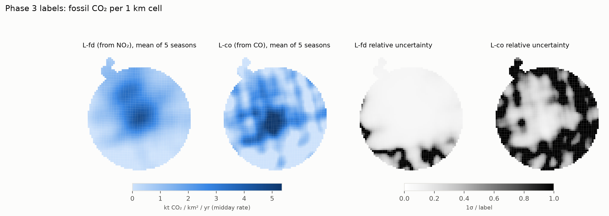
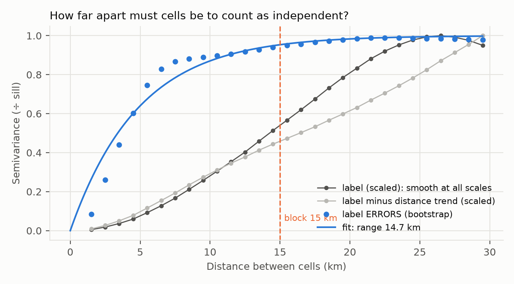

# EcoTrack — Phase 4 Report
## A larger training area, the model table, and honest cross-validation splits

**Project:** Meteorology-informed multi-source satellite estimation of urban fossil-fuel CO₂, Shivajinagar → Talegaon Dabhade corridor, Pune
**Author:** Janhavi Tupe · **Phase:** 4 of 8 (proposal week 7) · **Date:** 2026-10-10
**Status:** complete. New decisions **D22** (regional training grid) and **D23** (block size from label errors). The analysis plan for Phases 5–6 is written and ready to freeze.

---

## Summary

Phase 4 prepares the data the machine-learning experiments train on. A critical review of the corridor-only design found three problems:
1. **Too little independent data.** The labels are a ~5 km field: the corridor holds only about **3 independent areas** once blocks are sized properly.
2. **The labels are dominated by one smooth gradient** away from central Pune.
3. **Experiment B is likely null** at 1 km, because CO barely varies between cells.

This phase addresses them:
- **Training area enlarged (D22)** from 268 corridor cells to **2,894 cells** within 30 km of the source. The corridor is still the evaluation focus.
- **Model table built:** season-mean features joined to labels, 14,470 rows.
- **Spatial blocks sized from data (D23):** 15 km, from how far label *errors* stay correlated, giving **~13 independent areas** (vs ~3 in the corridor alone).
- **Four split schemes defined:** balanced 15 km block folds, corridor transfer, PCMC hold-out, leave-one-season-out.
- **Analysis plan** (`docs/phase5_analysis_plan.md`): experiments, controls, splits, metrics, a decision rule and written predictions, fixed before any model is trained.

## 1. The regional grid (D22)

| | Corridor grid | Regional grid |
|---|---|---|
| Cells | 268 | **2,894** (268 corridor + 2,626 outside) |
| Definition | ≥ 50% inside the corridor | centre within 30 km of the source and ≥ 5 km inside the TROPOMI box, plus all corridor cells |
| Feature rows (cell × month) | 10,720 | 115,760 |
| Label rows (cell × season) | 1,340 | 14,470 |

- **Same 1 km alignment:** every corridor cell is also a regional cell.
- **Switching grids:** `ECOTRACK_GRID=region`. All regional outputs carry `_region`; the corridor products are unchanged.

**Consistency checks.** Every layer for the 268 corridor cells is identical on both grids:

| Layer | Max relative difference |
|---|---|
| VIIRS, HCHO, ERA5 temperature/sunlight | ≤ 1e-15 |
| NDVI, NDBI | ≤ 4e-14 |
| OSM roads, industrial land | ≤ 1e-14 |
| GRIP4 roads | 1e-11 |
| Labels (corridor shares) | identical (20.7% / 14.3%) |

**What changes with a larger area:**
- **More spatial contrast.** The between-cell share of variance rises for NO₂ (0.34 → 0.57) and HCHO (0.03 → 0.15).
- **L-fd** keeps the central-Pune peak and shows a **second lobe over Pimpri-Chinchwad**, so there is structure beyond distance to learn. Noise ceiling 0.99.
- **L-co is weak away from the city:**
  - median uncertainty 63%;
  - 20% negative values;
  - agreement with L-fd r = 0.75 (vs 0.93 in the corridor).

  L-co results will be interpreted mainly on the corridor.
- **Night lights range** from 0.04 (dark rural and forest cells) to 111 nW/cm²/sr (city core).
- **Water bodies** (Khadakwasla, Pavana) enter: NDVI down to −0.33.



## 2. Engineering problems solved

1. **Out of memory reading OpenStreetMap.**
   - Cause: only 0.2 GB of RAM was free, and C: had too little space for Windows to grow its page file.
   - Fix: osmium's node-coordinate cache was moved to a file on D: (`sparse_file_array`). Results are identical, with no RAM spike.
   - The user then freed space on C: (now 14 GB free).
2. **Earth Engine was slow (6.5 min per month).**
   - Cause: every request uploaded all 2,894 cell outlines (~1.5 MB), even when it used 400.
   - Fix: each request is built from its own cells only. Now 1.7 min per month (3.6× faster).
3. **Two label-code bugs found only on the new grid, both fixed:**
   - the map figure read cell outlines from the corridor folder;
   - the smoothing check summed every regional cell as "corridor".

   The corridor labels were rebuilt byte-identical.

## 3. The model table

`data/processed/model_table_v1_region.csv`: one row per cell × season (14,470 rows).
- **Features:** the 17 Phase 2 features averaged over the season's months. Wind direction is circular, so it becomes sin and cos averaged as vectors (350° and 10° average to 0°, not 180°; tested).
- **Labels:** L-fd and L-co with their uncertainties.
- **Context:** coordinates, distance to source, cluster, `in_corridor`.
- **Split columns:** `block_id`, `fold_block`, `split_corridor`, `split_pcmc`.

The meta file records the variogram, block size, fold sizes and SHA-256.

## 4. How big must the cross-validation blocks be? (D23)

In spatial cross-validation, a test cell must not have a near-twin in the training set. How far apart is "far enough"? A **variogram** answers this: it measures how different two cells are, on average, as a function of the distance between them. Where it levels off, the cells stop being alike.

**First attempt: the label's own variogram.**
- Corridor: 7 km.
- Region: it **never levels off**. The labels are smooth at every scale, even after removing the distance trend, and the rule returned 100 km blocks (only 2 blocks). Unusable.

**The better question:** what exactly could leak between neighbouring cells?
1. **The smooth signal.** A model can interpolate it from location alone. That is precisely what the **geography-only null model** measures, and every experiment is scored as skill *above* it, so this is already controlled.
2. **Label errors.** The 5 km smoothing and the satellite footprint spread one error over several cells. **Blocks must stop this.**

**So blocks are sized to the label errors.**
- **Method:** rebuild the NO₂ map from 30 bootstrap resamples of the satellite days and compute the variogram of (resample − main map).
- **Result:** the errors level off cleanly, with a practical range of **14.7 km** → **15 km blocks**.
- **Not an artefact:** holding each resample's normalising total fixed gives the same 14.5 km.



| | Corridor only | Regional grid |
|---|---|---|
| Label-error range | 9.5 km (narrow shape: few long cell pairs across it) | **14.7 km** |
| Block size | 10 km | **15 km** |
| Blocks | 9 | **23** |
| Independent areas (cells ÷ block²) | ~3 | **~13** |

**Folds.** Random assignment of blocks gave folds of 207–1,057 cells, because edge blocks are partial. Blocks are now assigned largest first to the emptiest fold (seeded): **577–582 cells per fold**. Tested for balance and reproducibility.

## 5. Split schemes

| Split | Train | Test | What it tests |
|---|---|---|---|
| Spatial-block 5-fold (15 km) | 4 folds | 1 fold | General skill; robustness repeated at 10 and 20 km |
| Corridor transfer | 2,626 cells outside the corridor | 268 corridor cells | Generalising to an unseen area |
| PCMC hold-out | 2,600 cells > 5 km from PCMC | 63 PCMC cells (231 buffer cells unused) | Placing a second hotspot that distance alone can't predict |
| Leave-one-season-out | 4 seasons | 1 season | Temporal skill (L-fd only) |

## 6. The analysis plan

`docs/phase5_analysis_plan.md` fixes, **before any model is trained**:
- the four experiments (A–D) on both labels;
- the controls: geography-only null N0, shuffled-feature N1, a "beyond geography" residual target, and the feature-group ablation;
- fixed model settings (ridge, random forest, XGBoost);
- the metrics: skill over N0, spatial/temporal split, fraction of the noise ceiling;
- the **decision rule:** a difference counts only if its paired block-bootstrap 95% interval excludes zero;
- **seven written predictions**, including that Experiment B adds little spatial skill.

Its history table records every change made before freezing, including the block-rule change in §4.

## 7. Limitations

| Limitation | Effect | Handling |
|---|---|---|
| Still only ~13 independent areas | Small experiment differences may not be detectable | Paired comparisons; "no detectable difference" is a valid result |
| L-co noisy outside the city | Regional L-co scores mostly reflect noise | Interpret L-co on the corridor |
| ERA5 wind is uniform across the region (one point) | Weather features carry timing only | Stated; it can't leak spatial information |
| Regional labels farther than 25 km from the source | Flux-divergence maps degrade with distance | 30 km limit, 5 km box margin; error variogram includes this noise |
| ODIAC reference missing for 12 cells | Reference column only | Not a feature |

## 8. Next steps

1. **Freeze the analysis plan:** read it, then commit it to git *before* Phase 5.
2. **Phase 5:** run Experiments A–D, controls and splits exactly as planned.
3. **Phase 6:** the comparison table, ablation and robustness checks.

## Appendix — Reproducibility

```powershell
$env:ECOTRACK_GRID="region"
python -m ecotrack.grid
python -m ecotrack.acquire.grid_layers_gee      # ~1.2 h (Earth Engine)
python -m ecotrack.acquire.roads_grip
python -m ecotrack.acquire.osm_pbf
python -m ecotrack.features
python -m ecotrack.labels                       # ~10 min
python -m ecotrack.tensor                       # ~10 min (30 bootstrap maps)
Remove-Item Env:ECOTRACK_GRID                   # back to the corridor
python -m pytest                                # 17 tests
```

| Output | File |
|---|---|
| Regional grid | `data/interim/grid_region/cells.csv`, `cells.geojson` |
| Features / labels / model table | `data/processed/feature_table_v2_region.csv`, `labels_v1_region.csv`, `model_table_v1_region.csv` (+ `.meta.json`) |
| QA and figures | `outputs/phase2_region/`, `outputs/phase3_region/`, `outputs/phase4_region/variogram.png` |
